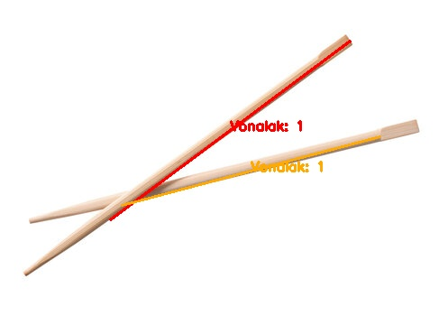

# Pálcika Detektor Program Dokumentáció

## 1. Bevezetés
A program célja képeken található pálcikák automatikus detektálása és megszámolása. A megvalósítás során különös figyelmet fordítottunk a kereszteződések és párhuzamos vonalak megfelelő kezelésére.

### 1.1 Példa Bemeneti Képek

*1. ábra: Első tesztkép pálcikákkal*


*2. ábra: Második tesztkép pálcikákkal*

## 2. Rendszerkövetelmények
- Python 3.x
- OpenCV (cv2) könyvtár
- NumPy könyvtár

## 3. Program Struktúra

### 3.1 Fájlrendszer
```
projekt/
├── main.py             # Fő program fájl
├── line_detector.py    # Vonalak detektálása
├── image_processor.py  # Képfeldolgozás
├── constants.py        # Konstansok
├── images/             # Bemeneti képek mappája
│   ├── palcika1.jpg
│   ├── palcika2.jpg
│   ├── palcika3.jpg
│   └── palcika4.jpg
└── output/             # Kimeneti képek mappája
```

### 3.2 Osztályok és Függvények

#### LineDetector Osztály
A `LineDetector` osztály felelős a vonalak matematikai feldolgozásáért és a geometriai számításokért. Az osztály minden metódusa statikus, így példányosítás nélkül használható.

##### Metódusok részletesen:

1. `line_length(line)`: 
   - Bemenet: Vonal koordinátái (x1, y1, x2, y2)
   - Kimenet: A vonal hossza pixelekben
   - Működés: Euklideszi távolság számítása a végpontok között
   - Használat: Vonalak szűrésénél és összehasonlításánál

2. `get_line_angle(line)`:
   - Bemenet: Vonal koordinátái
   - Kimenet: A vonal szöge fokban (0-180° között)
   - Működés: Arkusz tangens számítása, majd konvertálás fokokba
   - Használat: Párhuzamosság és kereszteződések vizsgálatánál

3. `find_intersection(line1, line2)`:
   - Bemenet: Két vonal koordinátái
   - Kimenet: Metszéspont koordinátái vagy None
   - Működés: 
     * Szögek különbségének ellenőrzése
     * Lineáris egyenletrendszer megoldása
     * Metszéspont validálása a vonalszakaszokon
   - Használat: Kereszteződések detektálásánál


*3. ábra: Kereszteződések detektálása az első képen*

4. `are_lines_parallel_and_close(line1, line2, max_angle_diff=15, max_distance=60)`:
   - Bemenet: Két vonal és opcionális paraméterek
   - Kimenet: Boolean érték
   - Működés:
     * Szögek különbségének számítása
     * Középpontok távolságának ellenőrzése
     * Vonalak közötti minimális távolság számítása
     * Irányvektor alapú ellenőrzés
   - Használat: Párhuzamos vonalak csoportosításánál

5. `merge_lines(lines, min_distance=60, min_angle_diff=15)`:
   - Bemenet: Vonalak listája és opcionális paraméterek
   - Kimenet: Összevont vonalak listája
   - Működés:
     * Vonalak rendezése hossz szerint
     * Párhuzamos vonalak csoportosítása
     * Legtávolabbi pontok összekötése
   - Használat: Töredezett vonalak egyesítésénél

6. `find_connected_lines(start_idx, merged_lines, intersection_map, parallel_groups)`:
   - Bemenet: Kezdő vonal indexe és kapcsolati térképek
   - Kimenet: Összefüggő vonalak halmaza
   - Működés:
     * Rekurzív keresés a kapcsolati gráfban
     * Párhuzamos és metsző vonalak követése
   - Használat: Vonalak csoportosításánál

#### ImageProcessor Osztály
Az `ImageProcessor` osztály a képfeldolgozási műveletek végrehajtásáért felelős. Az osztály szintén statikus metódusokat tartalmaz.

##### Metódusok részletesen:

1. `preprocess_image(image)`:
   - Bemenet: BGR színtérben lévő kép
   - Kimenet: Előfeldolgozott bináris kép és éldetektált kép
   - Működés:
     * Szürkeárnyalatos konverzió
     * Gauss-féle elmosás (kernel méret: 5x5)
     * Adaptív küszöbölés (Gaussian, inverz)
     * Morfológiai nyitás (kernel méret: 3x3)
     * Canny él-detektálás (küszöbök: 30, 150)
   - Használat: Nyers kép előkészítése a vonaldetektáláshoz


*4. ábra: Binarizált kép eredménye*


*5. ábra: Canny éldetektálás eredménye*

2. `detect_lines(edges)`:
   - Bemenet: Éldetektált bináris kép
   - Kimenet: Detektált vonalak listája
   - Működés:
     * Probabilisztikus Hough transzformáció
     * Paraméterek alkalmazása vonalszűréshez
   - Használat: Vonalak kezdeti detektálásához

3. `generate_distinct_colors(n)`:
   - Bemenet: Szükséges színek száma
   - Kimenet: BGR színek listája
   - Működés:
     * HSV színtérben egyenletes eloszlású színek generálása
     * Konvertálás BGR színtérbe
   - Használat: Vonalcsoportok vizualizációjához

## 4. Megvalósítás Lépései

### 4.1 Kép Előfeldolgozás
1. Szürkeárnyalatos konverzió
2. Gauss-féle elmosás zajcsökkentéshez
3. Adaptív küszöbölés
4. Morfológiai műveletek
5. Canny él-detektálás

### 4.2 Vonalak Detektálása
1. Hough transzformáció alkalmazása
2. Paraméterek:
   - rho = 1
   - theta = pi/180
   - threshold = 80
   - minLineLength = 150
   - maxLineGap = 20

### 4.3 Vonalak Feldolgozása
1. Vonalak szűrése hossz alapján (MIN_LINE_LENGTH = 200)
2. Párhuzamos vonalak keresése:
   - Szög különbség vizsgálata (max 15°)
   - Távolság ellenőrzése (MAX_PARALLEL_DISTANCE = 50)
3. Kereszteződések detektálása:
   - Minimális szögkülönbség ellenőrzése (MIN_ANGLE_DIFF = 30)
   - Metszéspont számítása és validálása

### 4.4 Vonalak Csoportosítása
1. Nem kereszteződő vonalak csoportosítása
2. Kereszteződő vonalak kezelése:
   - Közeli kereszteződések összevonása
   - Szög alapú csoportosítás
   - Kapcsolódó vonalak összegyűjtése

### 4.5 Eredmények Megjelenítése
1. Egyedi színek generálása minden vonalcsoporthoz
2. Vonalak rajzolása a megfelelő színekkel
3. Kereszteződések jelölése piros körökkel
4. Vonalcsoportok számának kiírása
5. Interaktív ablak létrehozása:
   - Átméretezhető ablak
   - Előtérbe helyezés
   - Billentyűleütésre várakozás


*6. ábra: Végső eredmény a második képen*



*7. ábra: Végső eredmény a harmadik képen*


*8. ábra: Végső eredmény a negyedik képen*

## 5. Felhasználói Interakció

### 5.1 Program Indítása
1. Program futtatása: `python main.py`
2. Kép kiválasztása:
   - 1-es gomb: palcika1.jpg
   - 2-es gomb: palcika2.jpg
   - 3-as gomb: palcika3.jpg
   - 4-es gomb: palcika4.jpg

### 5.2 Eredmények Megtekintése
1. Az eredmény ablak automatikusan megjelenik
2. Az ablak átméretezhető
3. A címsorban mozgatható
4. Bármely billentyű lenyomására bezáródik

### 5.3 Kimeneti Fájlok
A program az alábbi fájlokat menti az output mappába:
- `*_binary.jpg`: Binarizált kép
- `*_edges.jpg` : Él-detektálás eredménye
- `*_result.jpg`: Végső eredmény a jelölésekkel

## 6. Paraméterek Finomhangolása

### 6.1 Vonaldetektálás
- `MIN_LINE_LENGTH`: Minimális vonalhossz (default: 200)
- `MIN_ANGLE_DIFF`: Minimális szögkülönbség kereszteződéseknél (default: 30)
- `MAX_PARALLEL_DISTANCE`: Maximális távolság párhuzamos vonalaknál (default: 50)
- `MIN_LENGTH_RATIO`: Minimális hosszarány (default: 0.5)

### 6.2 Hough Transzformáció
- `threshold`: Akkumulátor küszöbérték (default: 80)
- `minLineLength`: Minimális vonalhossz (default: 150)
- `maxLineGap`: Maximális vonalrés (default: 20)

## 7. Hibakezelés
- Nem létező képfájl esetén hibaüzenet
- Érvénytelen felhasználói választás kezelése
- Sikertelen képbetöltés jelzése
- Pálcikák hiányának jelzése
